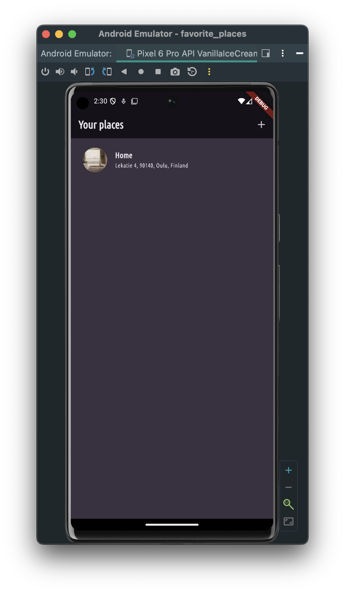
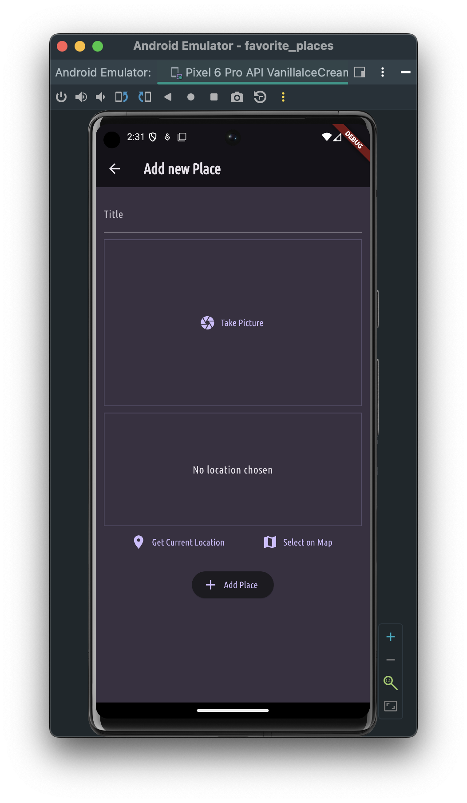
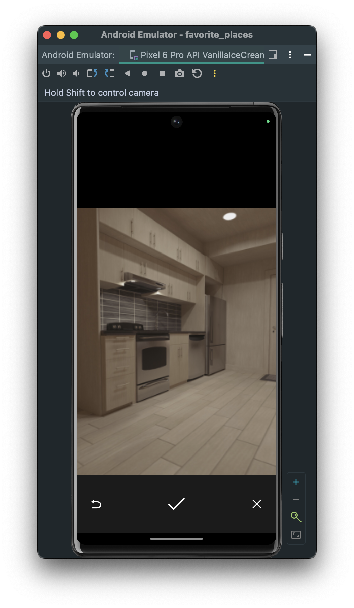
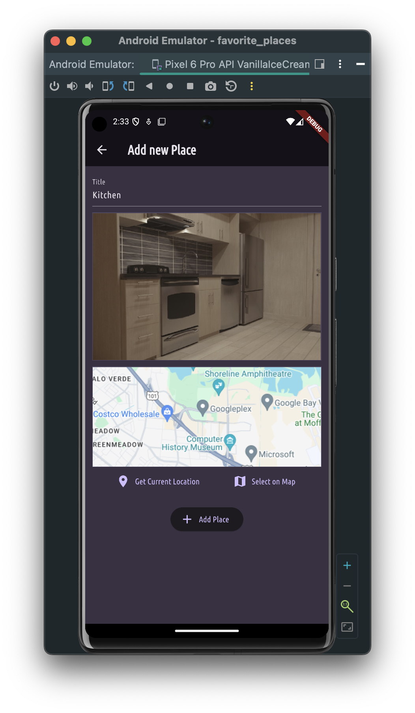
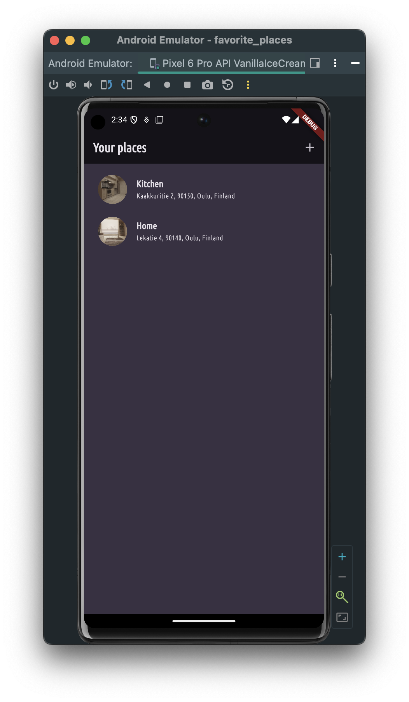
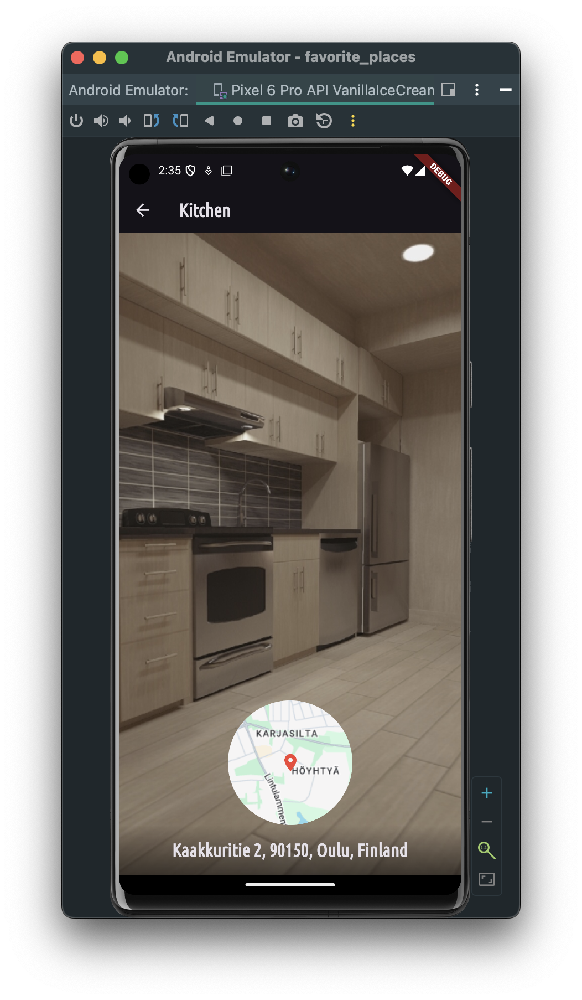

# Favorite places
The application was developed on a course https://www.udemy.com/course/learn-flutter-dart-to-build-ios-android-apps/

In this app, you can save your favorite places. For convenience, you can add a photo and geoposition of the place.

 

The project is based on Riverpod state-management. The app also features camera and geo-positioning capabilities.

